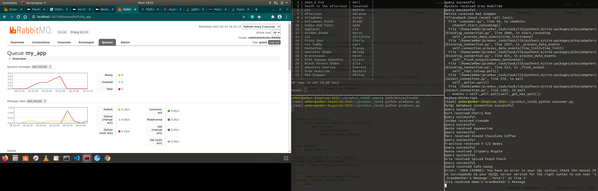

# TechStax_Task

## Setting Up Environment

1. Create a Virtual Environment
2. `pip install -r requirements.txt`

## Setting Up Database

1. Create a MySQL database with name **task**
2. Create a table **served** with following command
    `CREATE TABLE served (id int NOT NULL AUTO_INCREMENT, drink varchar(255), name varchar(255), PRIMARY KEY(id));`
    
## Setting Up Message Queue Handler (RabbitMQ)

1. Install Docker
2. Run the RabbitMQ server with following command
    `docker run -d -p 5672:5672 -p 15672:15672 rabbitmq:3.6-management-alpine`
3. Now RabbitMQ server is running on [http://locahost:15672](http://locahost:15672). Use the username and password `guest` to login.

## Running the project

1. Run consumer.py file `python consumer.py` which continuously checks for messages in queue and store them in db on arrival
2. Run producer.py file `python producer.py` which asynchronously call the 2 given APIs in every 5 seconds for 2 minutes and push the message in RabbitMQ.

